# DeFake

## Overview

**DeFake** is a web application designed to help traders **detect and analyze fake news in real-time**. It allows individuals to verify the authenticity of news articles and assess their credibility for a better decision making.  

## **What You Can Do with DeFake**  

- **Check if a news article is real or fake** using an advanced detection system.  
- **Analyze and review news content** to understand its reliability.  
- **Receive alerts and notifications** about suspicious or misleading information.  
- **Access reports and insights** on the credibility of various news sources.  
- **Ensure a trustworthy news environment** by reducing misinformation.  

The platform is designed to be **fast, reliable, and easy to use**, ensuring that users can quickly verify information and make informed decisions. 

## Features

- **Fake News Detection** – Uses a trained **ML model** for classifying news articles.  
- **User Management** – Handles user registration, authentication, and roles.  
- **Microservices Architecture** – Ensures modularity and scalability.  
- **News Analysis Service** – Processes and extracts insights from articles, social media and bloomberg data.
- **API Gateway** – Manages request routing efficiently.  
- **Logging & Monitoring** – Tracks system activities and performance. (PENDING) 
- **Notifications** – Sends alerts based on news credibility assessment. (PENDING) 
- **Database Integration** – Stores user and news data securely.  

## Architecture

```mermaid
graph TD;
    subgraph Frontend["Frontend 🎨"]
        style Frontend fill:#FFD700,stroke:#333,stroke-width:2px;
        UserInterface["Web App 💻"]
        style UserInterface fill:#FFD700,stroke:#333,stroke-width:2px;
    end

    subgraph Gateway["API Gateway 🚪"]
        style Gateway fill:#FFA500,stroke:#333,stroke-width:2px;
        APIGateway["Main Entry Point"]
        style APIGateway fill:#FFA500,stroke:#333,stroke-width:2px;
    end

    subgraph ServiceDiscovery["Service Directory 📡"]
        style ServiceDiscovery fill:#87CEEB,stroke:#333,stroke-width:2px;
        ServiceRegistry["Service Registration & Discovery"]
        style ServiceRegistry fill:#87CEEB,stroke:#333,stroke-width:2px;
    end

    subgraph Backend["Backend Services 🔧"]
        style Backend fill:#90EE90,stroke:#333,stroke-width:2px;
        UserService["User Management 👤"]
        style UserService fill:#90EE90,stroke:#333,stroke-width:2px;
        NewsService["News Analysis 📰"]
        style NewsService fill:#90EE90,stroke:#333,stroke-width:2px;
        MLModel["Fake News Detector 🧠"]
        style MLModel fill:#90EE90,stroke:#333,stroke-width:2px;
        NotificationService["Notification 📢"]
        style NotificationService fill:#90EE90,stroke:#333,stroke-width:2px;
        LoggingService["Logging 📜"]
        style LoggingService fill:#90EE90,stroke:#333,stroke-width:2px;
        MonitoringService["Monitoring 📊"]
        style MonitoringService fill:#90EE90,stroke:#333,stroke-width:2px;
    end

    subgraph Storage["Data Storage 🗄️"]
        style Storage fill:#D3D3D3,stroke:#333,stroke-width:2px;
        Database["Main Database"]
        style Database fill:#D3D3D3,stroke:#333,stroke-width:2px;
        LogDB["Log Storage"]
        style LogDB fill:#D3D3D3,stroke:#333,stroke-width:2px;
    end

    UserInterface -->|User Requests| APIGateway;
    
    APIGateway -->|Routes to| ServiceRegistry;
    
    APIGateway -->|Sends Requests to| UserService;
    APIGateway -->|Sends Requests to| NewsService;
    
    NewsService -->|Analyzes & Verifies| MLModel;
    
    UserService -->|Stores User Info| Database;
    NewsService -->|Stores News Data| Database;

    NewsService -->|Sends Alerts| NotificationService;
    UserService -->|Sends User Alerts| NotificationService;
    
    APIGateway -->|Sends Logs| LoggingService;
    LoggingService -->|Stores Logs| LogDB;
    
    LoggingService -->|Provides Data| MonitoringService;
    MonitoringService -->|Monitors Health| Backend;
```

## License

This project is licensed under the **MIT License**.

---

